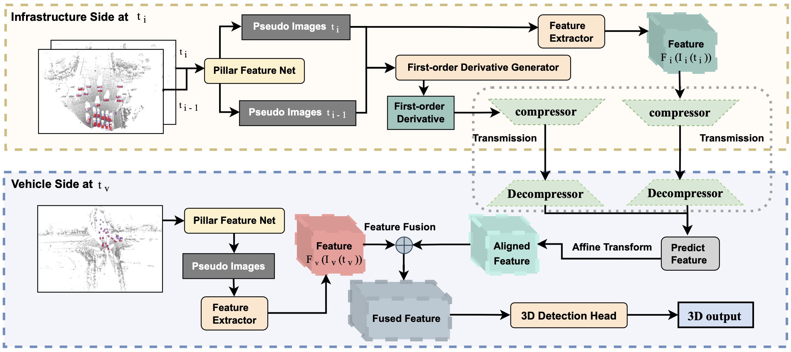

# FFNET: VEHICLE-INFRASTRUCTURE COOPERATIVE 3D DETECTION VIA FEATURE FLOW PREDICTION

<!--  -->
<div align="center">
  
</div>
<p align="center">
  Figure 1: FFNET OVERVIEW.
</p>

### [Project page](https://github.com/haibao-yu/FFNet-VIC3D) | [Paper](https://openreview.net/forum?id=ZLfD0cowleE) |

FFNET: VEHICLE-INFRASTRUCTURE COOPERATIVE 3D DETECTION VIA FEATURE FLOW PREDICTION.<br>
Under review as a conference paper at ICLR 2023.

This repository contains the official Pytorch implementation of training & evaluation code and the pretrained models for [FFNET](https://openreview.net/forum?id=ZLfD0cowleE).

FFNET is a simple, efficient and powerful VIC3D Detection method, as shown in Figure 1.

We use [MMDetection3D v0.17.1](https://github.com/open-mmlab/mmdetection3d/tree/v0.17.1) as the codebase.


## Installation

For install, please refer to the guidelines in [MMDetectionn3D v0.17.1](https://github.com/open-mmlab/mmdetection3d/tree/v0.17.1).
For data, please refer to the guidelines in [DAIR-V2X](https://thudair.baai.ac.cn/cooptest). We provide the example data [example-cooperative-vehicle-infrastructure](https://drive.google.com/file/d/1eLFy7_f1RapLPvAJLEDB8eUA8z1Meevz/view?usp=sharing), you can download and decompress it under './data/dair-v2x'.

Other requirements:
```pip install --upgrade git+https://github.com/klintan/pypcd.git```

An example (works for me): ```CUDA 11.1``` and  ```pytorch 1.9.0``` 

```
pip install torchvision==0.10.0
pip install mmcv-full==1.3.14
pip install mmdet==2.14.0
pip install mmsegmentation==0.14.1
cd FFNET-VIC3D && pip install -e . --user
```

## Evaluation

Download `trained weights`. 
(
[FFNET Trainded Checkpoint](https://drive.google.com/file/d/1eX2wZ7vSxq8y9lAyjHyrmBQ30qNHcFC6/view?usp=sharing) | [FFNET without prediction](https://drive.google.com/file/d/14ujtkGVMGGdvHnmEAUDArny6HKbYM_ye/view?usp=sharing) 
| [FFNET-V2 without prediction](https://drive.google.com/file/d/1_-C4MfUeC-6MXPDZlx6LTM48Tl8gdZpR/view?usp=sharing)
)

Example: evaluate ```FFNET``` on ```DAIR-V2X-C-Example``` with 200ms latency:

```
# Single-gpu testing
python tools/test.py ffnet_work_dir/config_ffnet.py /path/to/ffnet_checkpoint_file
```

## Training

Firstly, train the basemodel on ```DAIR-V2X``` without latency
```
# Single-gpu training
python tools/train.py ffnet_work_dir/config_basemodel.py 
```

Secondly, put the trained basemodel in a folder ```ffnet_work_dir/pretrained-checkpoints```.

Thirdly, train ```FFNET``` on ```DAIR-V2X``` with latenncy

```
# Single-gpu training
python tools/train.py ffnet_work_dir/config_ffnet.py  
```